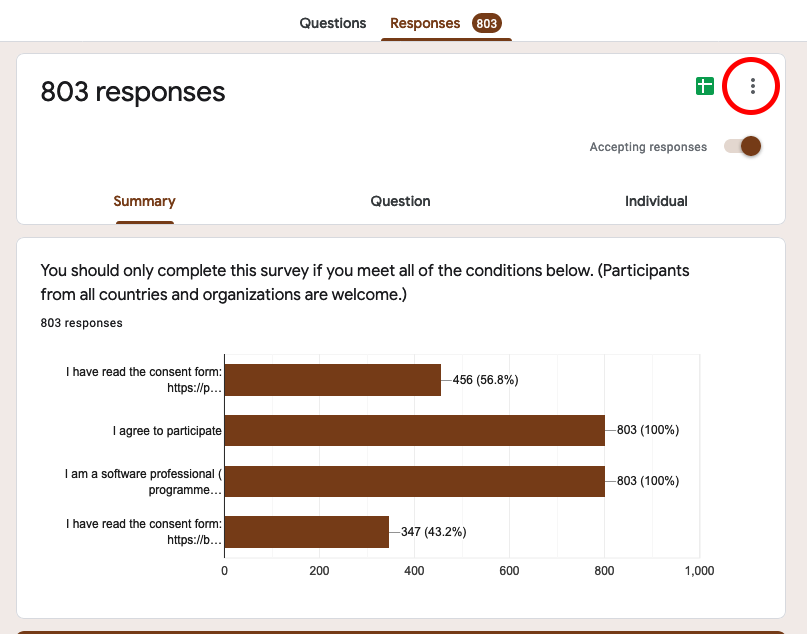
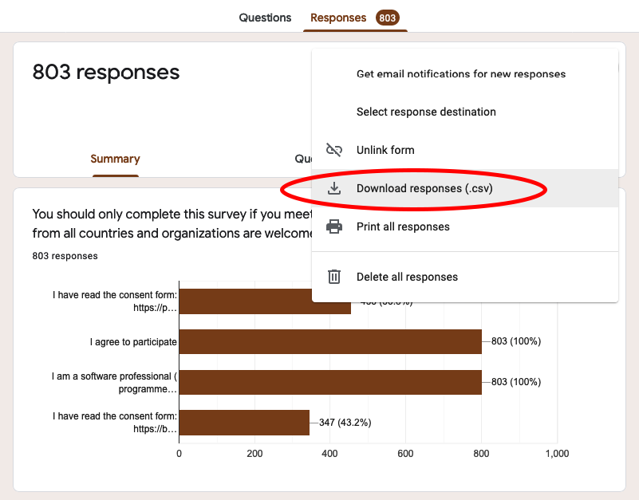

# Pandemic Programming Survey

We only publish the scripts, questionnaires, recoding instructions, as well the the recoded data in this repository.
The raw data is not published, because it contains open-ended responses of our participants, which we promised not to publish.

In the following, we provide the recoding instructions that [Sebastian Baltes](https://empirical-software.engineering) shared with all co-authors:

1) Download responses as a CSV file:

2) Rename the CSV file to `<LANGUAGE>.csv`, e.g. `English.csv` for the English version, and copy it into the `data` directory. Don't forget to save a backup locally, adding a timestamp as Paul described in his [instructions](doc/Data%20Cleaning%20Instructions.docx).

3) Update the information in `doc/Timestamps.csv`. This list should always correspond to the recoded data you put in the `data` directory.

4) Save a PDF version of your questionnaire using the print function that Google Forms provides. Save that file under `doc/<LANGUAGE>.pdf`, e.g. `doc/English.pdf` for the English version.

4) Send the files `<LANGUAGE>.csv` and `<LANGUAGE>.pdf` together with the time information to Paul and Sebastian via email.

5) Modify the script `preprocessing.R` for your language (see comments in the script).

6) Execute the script `preprocessing.R`, this should generate a file `<LANGUAGE>_filtered.csv` in the `data` directory.

7) Modify the script `recoding.R` for your language (see comments in the script). Please double-check whether the [variable mapping](doc/Variable%20Mapping.csv) is correct, because the question order may be randomized.

8) Execute the script `recoding.R `, this should generate a file `<LANGUAGE>_recoded.csv` in the `data` directory.

9) Create a new local Git branch named `<LANGUAGE>`, e.g. `english` for the English version, and push your changes into a new remote branch with the same name.

10) Let Paul and Sebastian know when you have pushed your changes.
